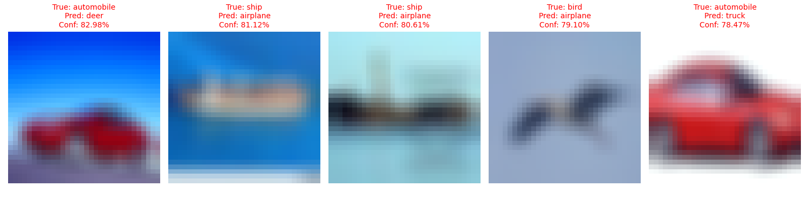

## Data Distribution & Model Failure Detection

Most ML models don't fail because they're poorly trained — they fail because the data changes. This project builds a system that detects when a ResNet-18 model is likely to fail due to distribution shift, **before labels are available**, on CIFAR-10.

It implements and evaluates four failure detection paradigms under two distribution shifts (Gaussian blur and Gaussian noise), and asks one question: **can we predict when the model will be wrong?**

## Setup

1. Create a virtual environment and install dependencies:
   ```bash
   python3 -m venv venv
   source venv/bin/activate
   pip install -r requirements.txt
   ```

2. Train the model:
   ```bash
   python train.py
   ```

3. Evaluate the detectors:
   ```bash
   python evaluate.py
   ```

4. Inspect individual failures:
   ```bash
   python inspect_failures.py
   ```

## Detection Methods Implemented

- **Confidence-based:** Softmax distribution entropy (single forward pass).
- **Monte Carlo Dropout:** Predictive entropy averaged over 15 stochastic forward passes.
- **Distance-based:** Mean k-NN distance from clean training embeddings.
- **OOD detection:** Unsupervised One-Class SVM trained only on clean (in-distribution) features.

Each method scores how likely a prediction is to be wrong. `evaluate.py` turns that score into an AUROC against actual model errors, for both the blur and noise shifts.

## Results

| Shift | Confidence | Distance | MC Dropout | OOD (SVM) |
|-------|-----------|----------|------------|-----------|
| Blur  | TBD       | TBD      | TBD        | TBD       |
| Noise | TBD       | TBD      | TBD        | TBD       |

*Run `python evaluate.py` to populate this table with AUROC scores, and commit the generated `plots/calibration_*.png` and `plots/acc_vs_conf_*.png` files so reviewers can see the calibration behavior without re-running training.*

## Additional Failure Inspection

The core focus of this repository is highlighting *confidently wrong* predictions — cases where the model assigns high softmax confidence to the wrong class under distribution shift. `inspect_failures.py` surfaces the highest-confidence mistakes on the blurred test set:



## Possible Extensions (not yet implemented)

- Combine confidence + distance into a single learned meta-model that predicts failure directly.
- Add a deep ensemble as a second uncertainty-based method alongside MC Dropout.
- Use SHAP or saliency maps to explain *why* specific failures happen.
